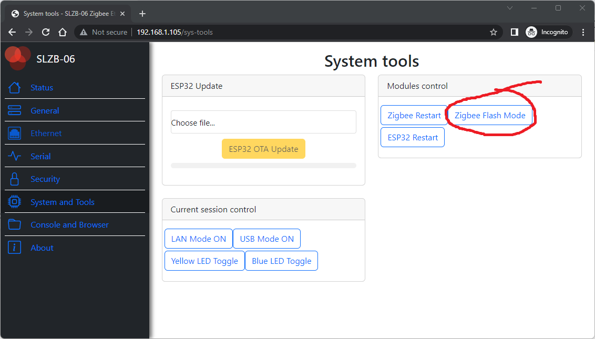

# Updating CC2652P

## Over the Air (OTA) update
1. Download latest Zigbee firmware. SLZB-06 Adapter is based on CC6252P from Texas Instruments. Firmwares are based on Z-Stack. You can see the best one here [Koenkk Z-Stack firmware on Github](https://github.com/Koenkk/Z-Stack-firmware/tree/master/coordinator/Z-Stack_3.x.0/bin). Use frmware with a tag **"...other_coordinator_"**;
2. Go to SLZB-06 web interface;
3. Select menu item "System tools" and press "Zigbee Flash Mode". 

Go to menu Console and Browser and re-check that console contains message "Now you can flash Zigbee!"
4. Use for flashing any of the tools described at [Zigbee2MQTT official web page here:](https://www.zigbee2mqtt.io/guide/adapters/#flashing-cc1352-cc2652-cc2538-based-adapters). We reccomend to use official Texas Instruments flashing software.
5. Restart your adapter (by pressing button "Restart ESP" at meny "System and Tools")

## Update with J-TAG
SLZB-06 adapter contains DIY pinouts that enable users to flashe directly by J-TAG. Please note, that pin-outs are 1.27mm size, not commonly used 2.54mm size. 

